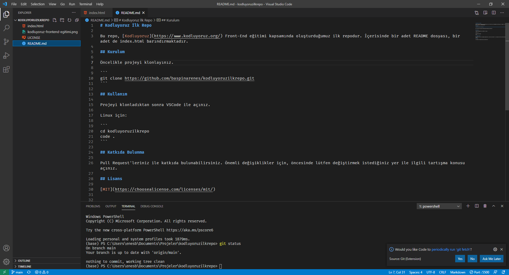

# Kodluyoruz Front-End Eğitimi İlk Repo



Bu repo, [Kodluyoruz](https://www.kodluyoruz.org/) Front-End eğitimi kapsamında oluşturduğumuz ilk repodur. İçerisinde bir adet README dosyası, bir adet de index.html barındırmaktadır.

## Kurulum

Öncelikle projeyi klonlayınız.

```
git clone https://github.com/baspinarenes/kodluyoruzilkrepo.git
```

## Kullanım

Projeyi klonladıktan sonra VSCode ile açınız.

Linux için:

```
cd kodluyoruzilkrepo
code .
```

## Katkıda Bulunma

Pull Request'leriniz ile katkıda bulunabilirsiniz. Önemli değişiklikler için, öncesinde lütfen değiştirmek istediğiniz yer ile ilgili tartışma konusu açınız.

## Lisans

[MIT](https://choosealicense.com/licenses/mit/)


